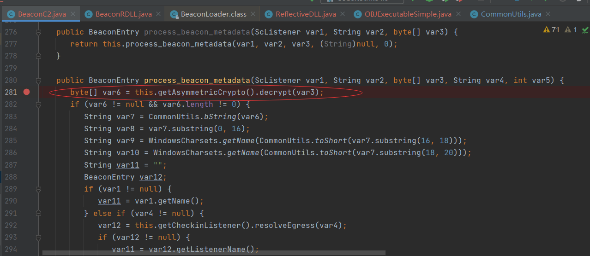
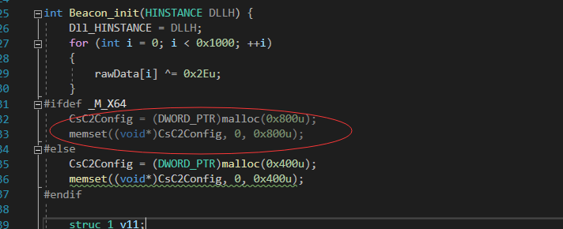
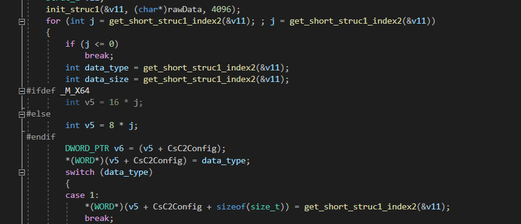
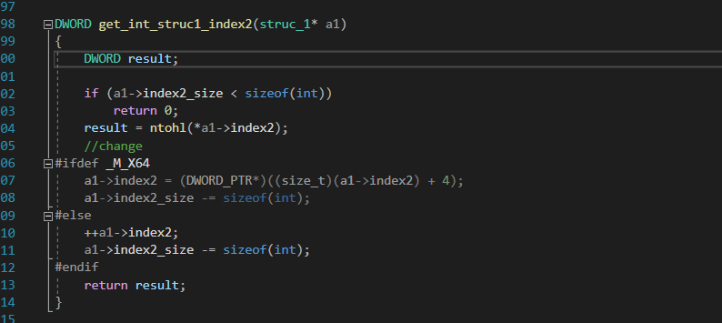
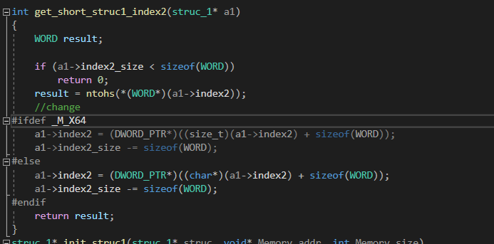
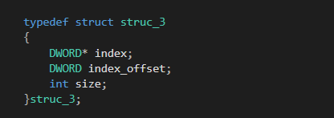
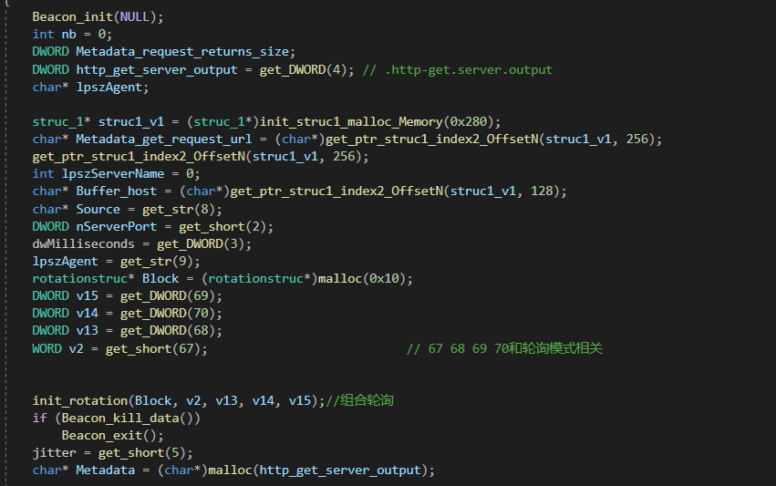
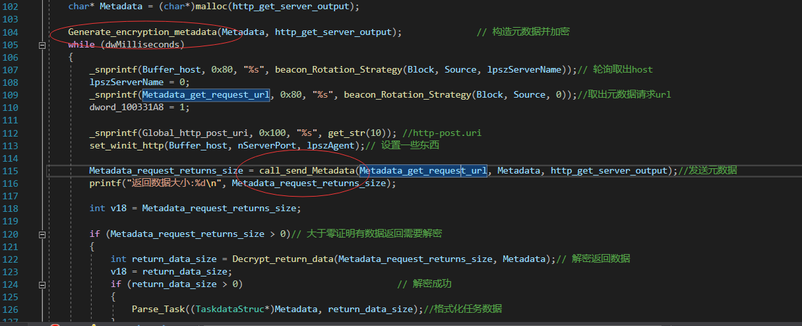
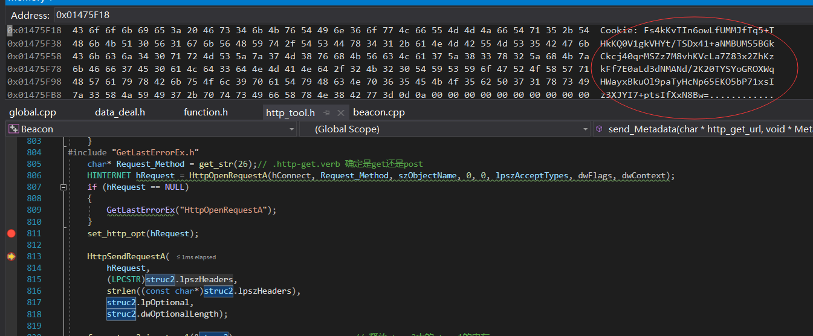
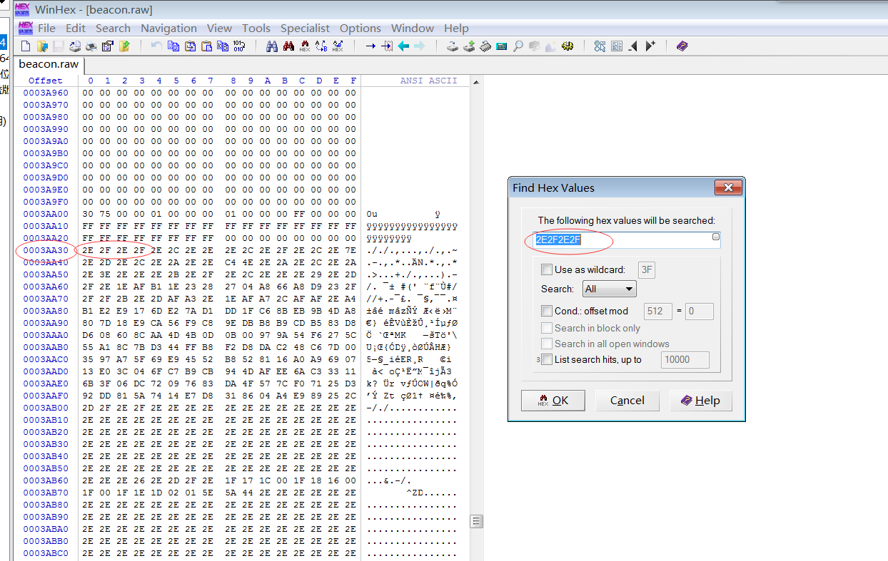

# beacon实现

最近闲来无事，正好WBGIII大佬逆向了beacon，我觉得站在巨人的肩膀上干事情比较快，索性就拿着beacon分析了一波，这次patch修源码，让其适配64位还是学到了不少东西的

具体链接 https://github.com/WBGlIl/Beacon_re

建议先下载一份源码，对照着看，防止看不懂系列，文章内容会涉及较多源码内容。

## 序言

这个逆向工程量有点大，我在逆向cmdshell的时候发觉代码量有点大，一晚上折腾下来有点坚持不下去了，不如分享出来，集齐大伙的思想，一起想办法逆向出来。或者直接重写cs的功能，这个设想我有了，可以参照gh0st的源码，c++写的，但是cs做了较多的异常处理以及权限判断等，需要分析下才能参照重写，有时间慢慢整吧，把这段时间的成果分享下。

目录结构

- Project文件夹(可以直接编译运行的vs工程，替换global.cpp的shellcode即可，那里有64位跟32位shellcode设置)
- reverse_things
  - beacon.x64.dll(原生dll)
  - beacon.x64.dll.i64(写了一些备注的ida文件)
  - x86的没咋弄

自行食用


下面进入正文吧。


## 调试teamserver端

因为要实现beacon.dll，必然要调试teamserver端，或者wireshark抓取数据包，这里我是选择的是调试teamserver端，在cobalt strike二开的基础上，修改build artifacts的主函数aggressor.Aggressor


将其修改为server.TeamServer，再开启debug模式就是teamserver端了，在run界面部分添加参数


VM options部分

```
-XX:ParallelGCThreads=4 -Xms512m -Xmx1024m -Dcobaltstrike.server_port=51000 -Djavax.net.ssl.keyStore=D:/CB_4.3/cobaltstrike.store -Djavax.net.ssl.keyStorePassword=Mannix123456 -server -XX:+AggressiveHeap -XX:+UseParallelGC
```

Program arguments部分

```
192.168.1.103 123456
```

在BeaconC2.java此处下断点



为的是截取数据包，meta data数据在此解密

## 实现beacon64

因为32位beacon已经实现收发包功能了，那么现在我需要做的是，实现64位beacon的收发包功能，其实32位跟64位差别不是很大，就是数据结构需要调整一下。

具体改动部分如下


开头的tomcrypt库需要控制好版本差异




在Beacon初始化的时候，结构体大小不同



在生成C2配置文件的时候，偏移需要修改


读取配置文件的部分也需要进行修改适配



读取int时候的修改，这里看个人



get_short同样修改


rawData做好版本修改



数据结构进行稍微调整


总共就这么点需要适配的地方，但很多都是通过调试得来的

## 流程分析

首先是xor解密，这个从二开cs可以知道，默认的配置是用0x2e异或加密的，而原生的beacon.dll有个AAAABBBB作为定位，在生成shellcode或者获取的时候，进行patch，总共大小0x1000字节。


Beacon_init函数，就是对配置进行解密，异或完成过后，通过循环读取，写入C2Config变量


读取方式见下图


这是xor解密过后的原生配置，分四块来说，

1. 第一块为标记位，标志结束与否
2. 第二块为data_type，类型判断，看是读取short，int，还是需要申请空间存放的字符串
3. 第三块为data_size，在需要申请空间的时候，这里就作为大小了
4. 第四块为写入内容，如果是short，int直接写入即可

特点:

- 每次读两个字节
- 每次循环分别至少需要读三次get_short




解密完过后，这一大段都是进行数据的设置，设置User-Agent，Source我这里测试用的ip，ServerPort就是端口，还有时间，以及轮询方式的设置



在这里需要重点关注的两个点就是这里，生成加密的metadata以及发送Metadata


这里其实就是发送给服务端的数据了


拿到原生数据先看一下，后面会拿rsa加密，这里的beef是标识头，作为服务端解密认证的一个标志，最后的是，上线的一个PC名称，以及进程名称，这里叫Beacon.exe


rsa加密后的数据，这个调试teamserver的时候可以接受的这些数据进行查看



我不一步步调试给你们看了，到最后会发觉，他会将meta数据打包成Cookie，在请求包中携带加密的cookie发送给服务端，服务端收到这个cookie后进行rsa解密

## vs studio生成

首先cobalt strike获取beacon.raw，winhex打开



查找到这里，选择4096字节，复制到C source即可，替换


64位替换64位的，32位替换32位的


这里我将代码进行了重构，直接就可以编译了


64位


## 总结

谢谢WBGIII大佬的分享，虽然代码有点乱，但是可能是直接逆向出来未经过整理就发布的，还是得感谢下大佬，以后的话，在原始的beacon上慢慢加功能，到时候替换到cs原生的beacon.dll，内存特征就比较容易去除了

